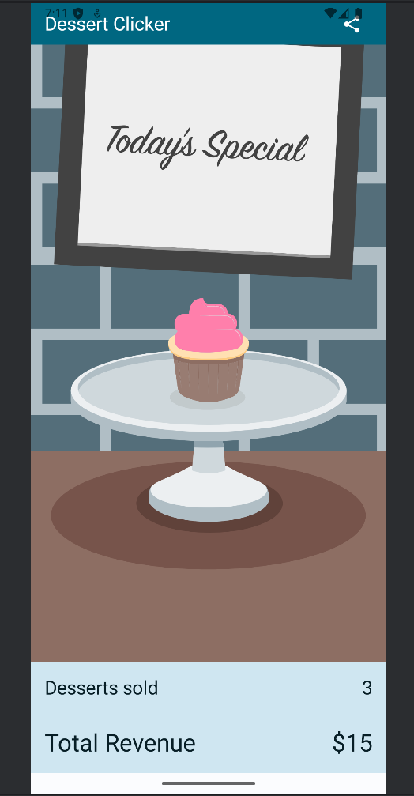
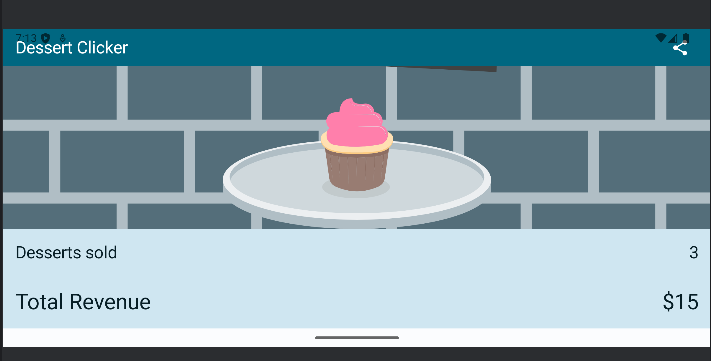
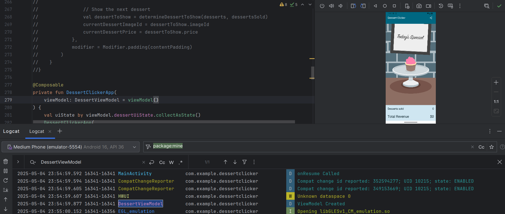

# Programming Portfolio - Second Set of Exercises

*Please complete this document to confirm the work that has been done. You will also add your answers to the provided 
questions in the space provided*

Please replace ${\color{green}-- todo}$ with ${\color{blue}-- completed}$ once done.\
\
Include an appropriate screenshot from your application to confirm completion. Screenshots should be added to 
the /images folder in the top-level repo.\
\
Include the provided question for your exercise and your answer in the space provided.

---

### Cupcake ###

|   **First Part ${\color{blue}-- completed}$**   |   **Extension ${\color{blue}-- completed}$**    |
|:-------------------------------------------:|:-------------------------------------------:|
|  |  |
|  |  |
|  |  |
|  |  |
|  |  |

#### Question ####
> In the CupCake example, a NavHostController object is used. This allows the popBackStack method
> to be called. Which class does the NavHostController extend that contains the popBackStack() method? 
>  
> Which other method(s) in this parent class is/are used to move between the other screens in the Cupcake
> example? How are these used - please make reference to the code and not just the visual output?  

#### Answer ####
> In the Cupcake example, NavHostController inherits from NavController, which includes the popBackStack() method.
> 
> Another key method in this base class is navigate(), which is used to switch between screens in the Cupcake app.
> 
> The navigate() method requires a route parameter in the form of a String to identify the destination screen. It’s used in the code as follows:
> 
> navController.navigate(CupcakeScreen.Flavor.name)
> 
> This is used to navigate from Start to Flaour screen. similarly the function is also used to navigate to other screens.

---
### DiceRoller ###

|    **First Part ${\color{blue}-- completed}$**     |     **Extension ${\color{blue}-- completed}$**     |
|:----------------------------------------------:|:----------------------------------------------:|
|  |  |  |

#### Question ####
> *onCreate* is passed a parameter *(savedInstanceState: Bundle?)*. What is this? 
> What value will it have on first run. Please evidence this value with the use of the debugger and an appropriate screenshot.   
>
> What may cause this Bundle to change in DiceRoller?
>
> In your own implementation of DiceRoller, are you using this Bundle in anyway. 
> Please note that depending on how you have approached DiceRoller will determine the correct response to this section.
>  

#### Answer ####
> It is used to hold values you saved earlier in onSaveInstanceState
> 
> On first run it will have "null" value as shown in the screenshot below
> 
> 
> 
> The changes in DiceRoller may be caused when we rotate our deviceor change in laguage or font size as shown in the screenshot below.
> 
> 
> 
> Yes, I am using Jetpack Compose "remember" function to hold the state
> 
>

---

### DessertClicker ###

|      **First Part ${\color{blue}-- completed}$**       |       **Extension ${\color{blue}-- completed}$**       |
|:--------------------------------------------------:|:--------------------------------------------------:|
|  |  |
|  |  |

#### Question ####
> In completing the extension for DessertClicker you will have created a ViewModel class. Why is a viewmodel
> class instance created with the first line shown below and not the second? 
>
> **val viewModel: DessertViewModel = viewModel()** 
>
> **val viewModel: DessertViewModel = DessertViewModel()** 
>
> How might this understanding be evidenced through the use of the debugger. Please include a screenshot.
> 
> What design patterns are being used here.  
>
> (Please note that if you have not completed the extension to DessertClicker - you can use MarsPhoto ViewModel as the 
> case study for the question)  

#### Answer ####
> Calling DessertViewModel() directly makes a new instance on every recomposition or configuration change, so any UI state is lost and old objects linger in memory. Using viewModel() hands off creation to ViewModelProvider, 
> which gives you one persistent instance tied to the activity or navigation scope, so your state survives and no leaks occur.
> 
> With DessertViewModel() you’ll spot a log entry each time the screen is recreated; with viewModel() you’ll see just one “DessertViewModel created” message for the entire lifecycle, even across rotations or back-and-forth navigation:
> 
> 
> 
> Under the hood, viewModel() implements a scoped singleton (one instance per lifecycle boundary) and a basic form of dependency injection through ViewModelProvider.

---
### MarsPhoto ###

|    **First Part ${\color{green}-- todo}$**    |    **Extension ${\color{green}-- todo}$**     |
|:---------------------------------------------:|:---------------------------------------------:|
|  |  |

#### Question ####
> *Please copy from the feedback branch when provided*
>  
>  
>  

#### Answer ####
> *Please provide your answer in this space*
> 
> 
> 
> 

---

